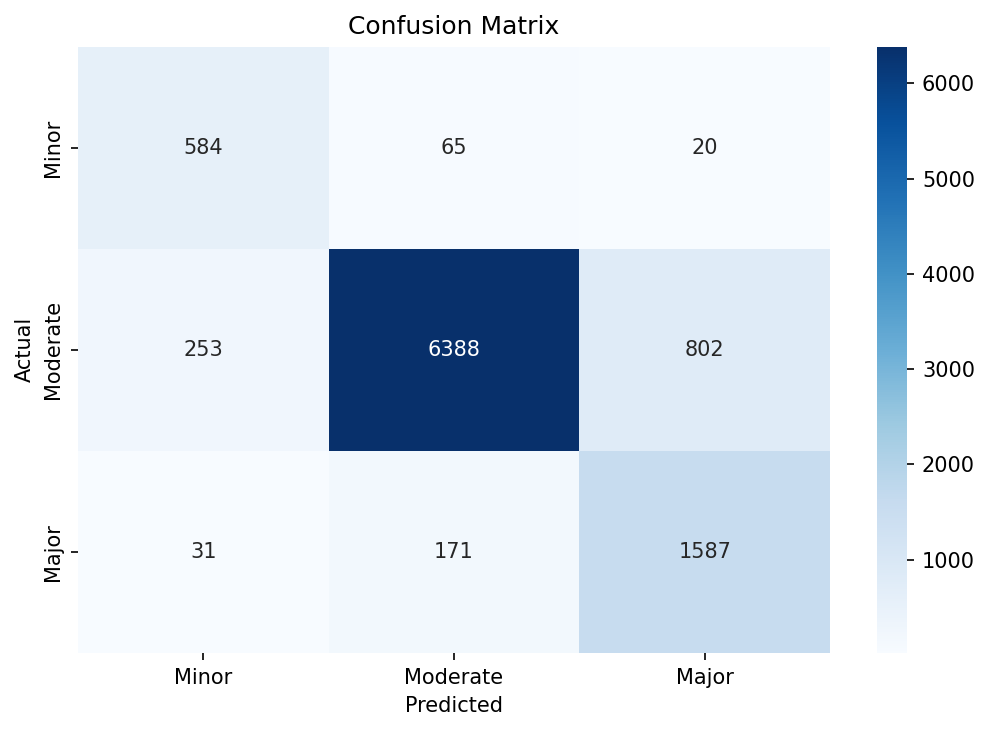
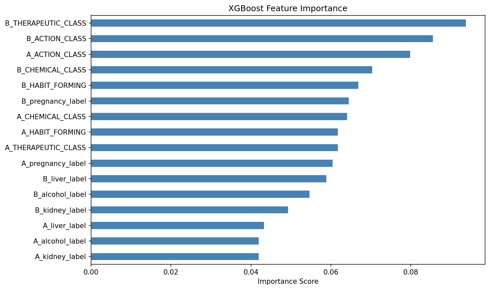
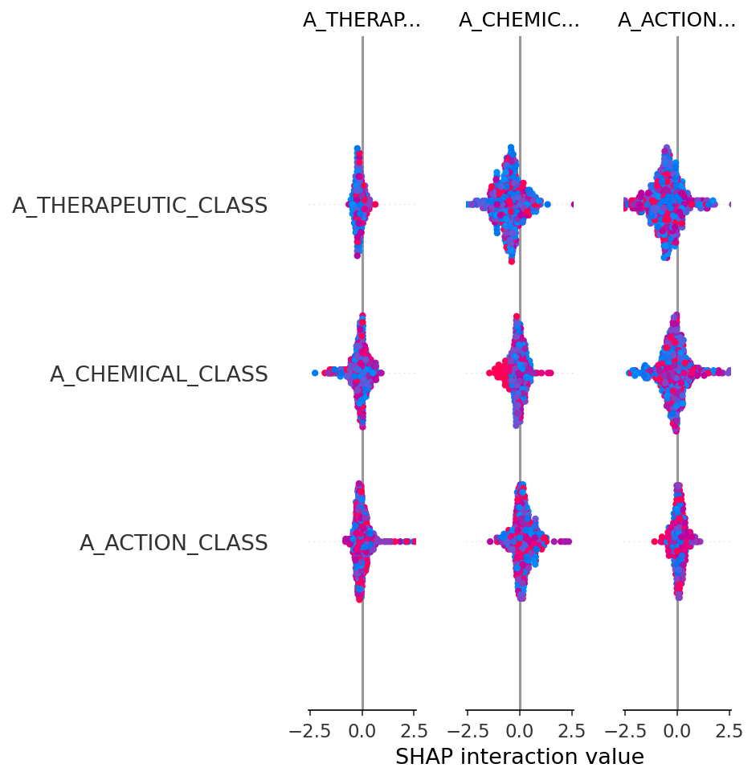

# 💊 DrugSafe AI – Drug-Drug Interaction Prediction & Explanation System

DrugSafe AI is a machine learning–powered system that predicts potential drug-drug interactions and classifies their risk levels. It also generates human-readable explanations using SHAP and LLMs to help users understand the impact of combining medications.

---

## 🚀 Live Demo
Access the deployed app here:
👉 https://drugsafe-ai.onrender.com

---

## 🚨 Problem Statement

Drug-drug interactions (DDIs) can lead to severe health risks, including reduced drug effectiveness or harmful side effects. Identifying these interactions manually is complex and error-prone.

This project aims to:
- Predict interaction risk between two drugs
- Provide interpretable insights using SHAP
- Generate natural language explanations using LLMs

---

## ⚙️ How It Works

1. Input: User provides two drugs  
2. Prediction: XGBoost model predicts interaction risk level  
3. Explainability: SHAP identifies feature importance  
4. LLM Explanation: NVIDIA NIM API generates human-readable explanation  

---

## 🧠 Tech Stack

- Machine Learning: XGBoost  
- Explainability: SHAP  
- Backend: FastAPI  
- Frontend/UI: Gradio + HTML  
- LLM Integration: NVIDIA NIM API  

---

## 🖥️ Demo (Screenshots)

### Model Performance


### Feature Importance


### SHAP Summary


---

## 🚀 How to Run

### 1. Clone the repository
```bash
git clone https://github.com/truptighate/DrugSafe-AI.git
cd DrugSafe-AI
```

### 2. Install dependencies
```bash
pip install -r requirements.txt
```

### 3. Run the application (Recommended)
```bash
python app/gradio_app.py
```

### Alternative (API mode)
```bash
python app/server.py
```

---

## 📁 Project Structure

```
DrugInteraction_project/

├── app/
│   ├── predict.py
│   ├── explain.py
│   ├── server.py
│   ├── gradio_app.py
│   └── static/
│       └── index.html

├── data/
│   └── final_dataset.csv

├── models/
│   ├── xgb_model.json
│   └── label_encoders.pkl

├── notebooks/
│   ├── 01_EDA_MID.ipynb
│   ├── 02_DDInter_Setup_and_Merge.ipynb
│   └── 03_Model_Training.ipynb

├── outputs/
│   ├── confusion_matrix.png
│   ├── feature_importance.png
│   └── shap_summary.png

├── requirements.txt
└── README.md
```

---

## 📊 Model Details

- Dataset: MID + DDInter merged dataset (~49,505 rows)  
- Model: XGBoost Classifier  
- Features: Encoded drug properties and interaction signals  
- Explainability: SHAP for feature-level interpretation  

---

## 🔍 Example Use Case

Input:
```
Drug 1: Aspirin  
Drug 2: Ibuprofen
```

Output:
```
Risk Level: Moderate  
Explanation: The combination may increase the risk of side effects. Use with caution.
```

---

## ⚠️ Limitations

- Model predictions depend on training data quality  
- Not a replacement for professional medical advice  
- Limited to known drug interaction patterns  

---

## 📌 Future Improvements

- Deploy as a live web app  
- Add more comprehensive drug database  
- Improve explanation accuracy using advanced LLMs  
- Build mobile-friendly interface  

---

## 👩‍💻 Author

Trupti Ghate
